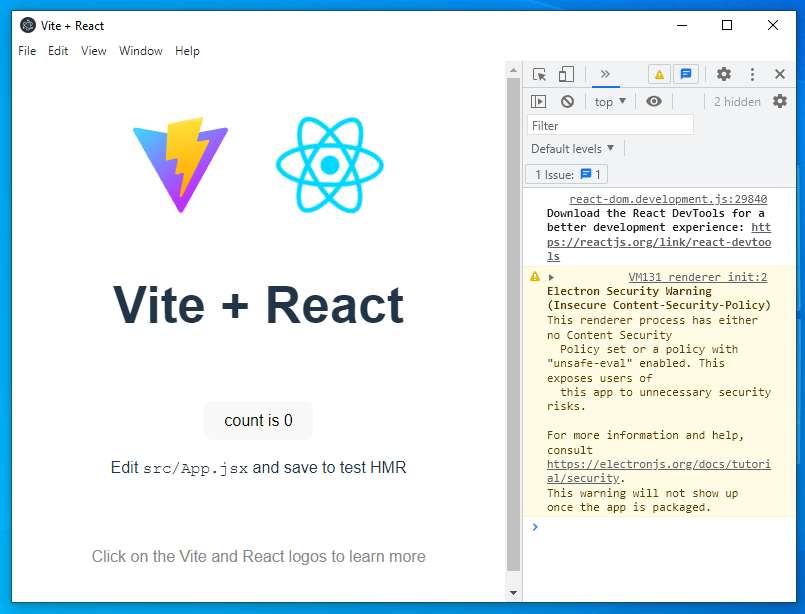

# React.js + Vite.js + Electron Basic Project Template

This repositorie allows to create a faster electron project via vite (react)

### How To Install&Use ?

```code
mkdir electron-app
cd electron-app
git clone https://github.com/byRespect/react.js-vite.js-electron.js-base .
yarn
yarn dev
```

and ta da :partying_face:

# Preview

<p align="center">
    
</p>
